# Physicraft - 3D Voxel Game Engine

Physicraft is a prototype 3D game engine written in **C++17** and **OpenGL**. It includes a playable voxel-world demonstration inspired by Minecraft, used to showcase procedural terrain generation, real-time rendering, player interactions, dynamic voxel objects, and a custom rigid-body physics engine.

The project was developed for the **HAI819I Game Engine** course in the M1 Informatique program at the University of Montpellier.

## Project Context

This repository is my personal fork of a two-person group course project. The objective of the course was to design a small 3D engine, implement the essential engine systems, and add a technically challenging specialization.

Our specialization is a procedural voxel world whose blocks can interact with the physics engine. The terrain is divided into chunks and generated around the player, while voxel structures can become dynamic rigid bodies, collide, rotate, and fall under gravity.

The engine architecture is inspired by Godot's scene system. A scene contains a hierarchy of nodes, and a dynamic object can be composed of a `RigidBody3D` node with `Collider3D` and `Mesh` children. Each `Node3D` stores both a local and a world transform.

## Demo

<p align="center">
  <a href="rapport/videos/demo_mid_quality.mp4">
    
  </a>
</p>

<p align="center"><em>Gameplay demonstration. Click the GIF to open the higher-quality MP4 video.</em></p>

## Features

- Godot-inspired scene graph with local and world transforms.
- Chunk-based procedural voxel terrain generated with Perlin noise.
- Hidden-face removal and one combined mesh per terrain chunk.
- Blinn-Phong and Cook-Torrance PBR rendering pipelines.
- HDR skybox, image-based lighting, directional lights, and shadow mapping.
- Custom rigid-body physics with collision detection and contact resolution.
- Physical interactions between cubes, terrain, and editable dynamic voxel structures.
- First-person controls, block inventory, block placement/removal, and projectile objects.

### Procedural Voxel Terrain

The procedural terrain system, mainly developed by Titouan Guibert-Lodé, divides the world into chunks generated around the player. Perlin noise defines the terrain height, while depth determines the grass, dirt, and stone layers. Each chunk uses one combined mesh containing only exposed block faces.

<table>
  <tr>
    <td align="center">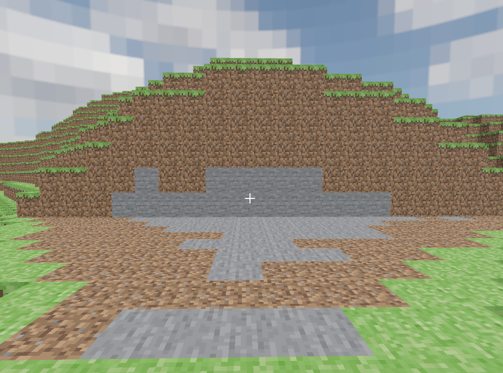<br><sub>Grass, dirt, and stone layers</sub></td>
    <td align="center">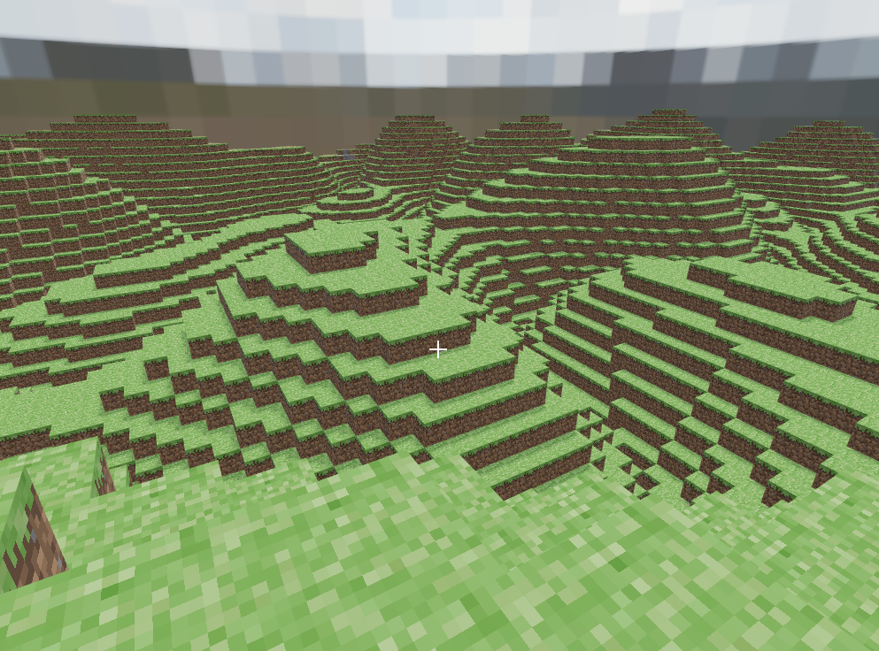<br><sub>Chunks generated around the player</sub></td>
    <td align="center">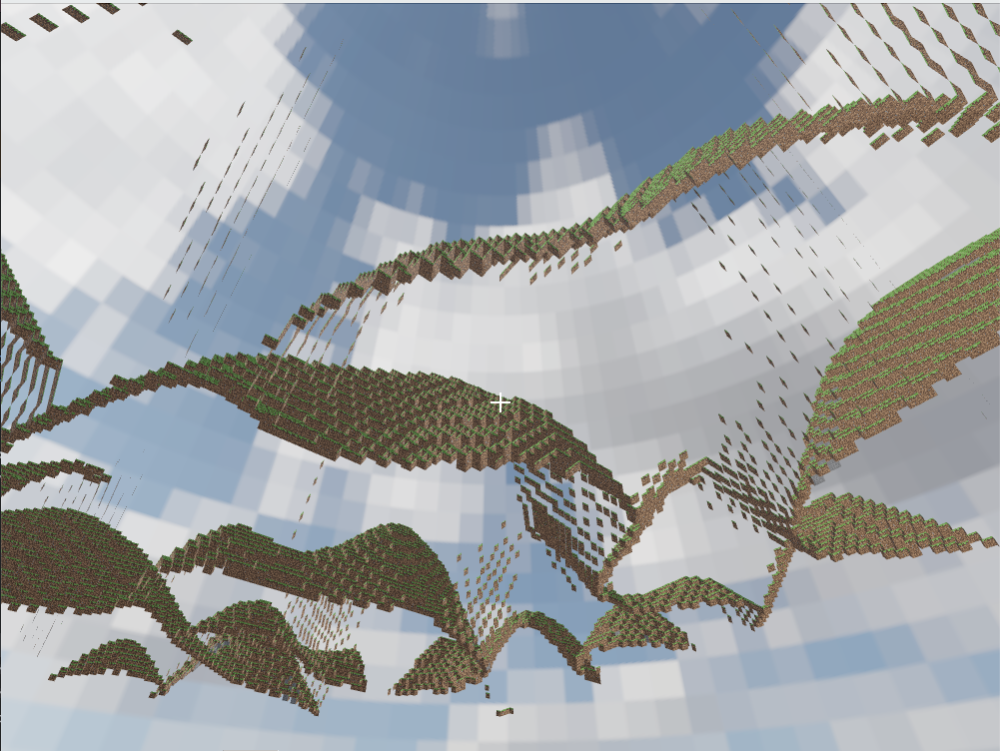<br><sub>Only exposed voxel faces are generated</sub></td>
  </tr>
</table>

### Player Interactions

The character controller, inventory, GUI, and block-editing interactions were mainly developed by Titouan. The player can explore the terrain, collect blocks, place them on static or dynamic voxel structures, and throw inventory blocks as rigid bodies.

<p align="center">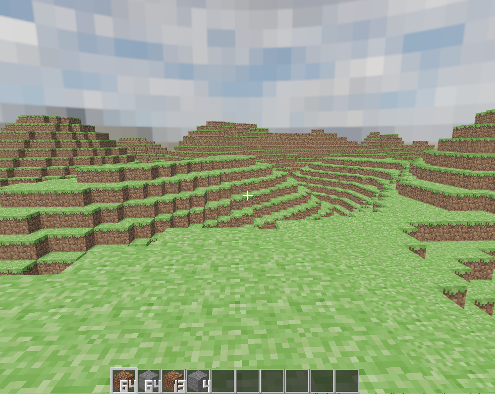</p>

<table>
  <tr>
    <td align="center">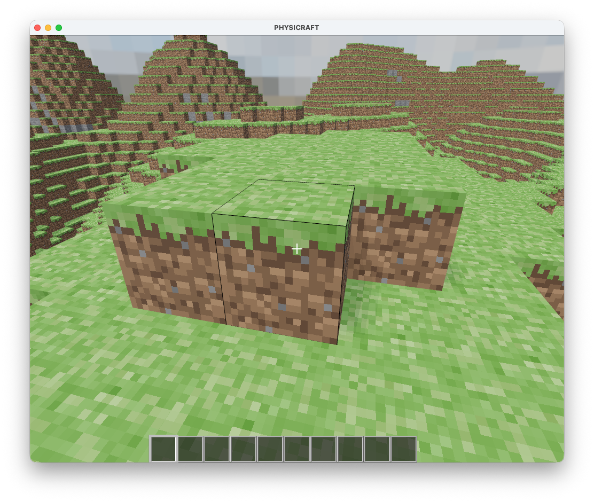<br><sub>Initial terrain</sub></td>
    <td align="center">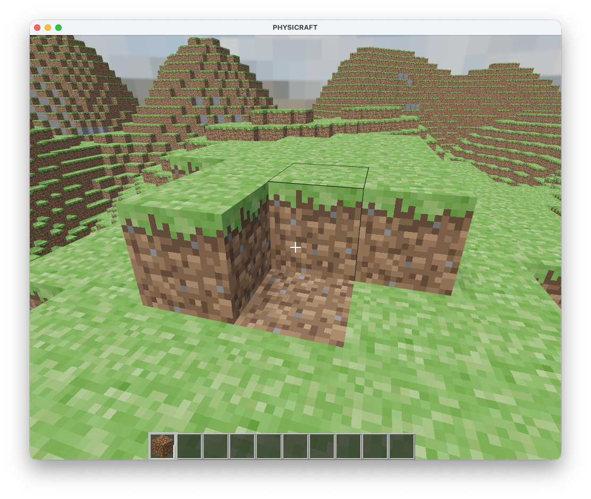<br><sub>Removing a block</sub></td>
    <td align="center">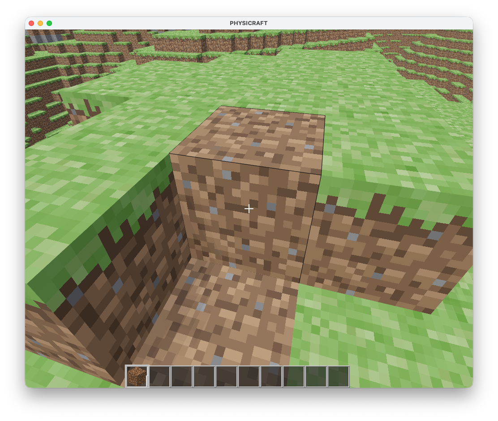<br><sub>Placing a block</sub></td>
  </tr>
</table>

## Controls

| Input | Action |
| --- | --- |
| `ZQSD` / `WASD` | Move the player |
| Mouse | Look around |
| Left click | Break a block and add it to the inventory |
| Right click | Place the selected inventory block |
| Mouse wheel | Change the selected inventory slot |
| `E` | Throw the selected inventory block as a rigid body |
| `V` | Launch a larger dynamic voxel structure |
| `1` to `5` | Launch cubes using five different PBR materials |
| `F` | Enable or disable player gravity |
| `Space` | Jump, or move upward when gravity is disabled |
| `Left Shift` | Move downward when gravity is disabled |
| `H` | Show or hide the user interface |
| `Escape` | Open or close the pause menu |

## Main Loop

Each frame follows this general sequence:

1. Poll input events.
2. Update scene nodes with `process`.
3. Run one or more fixed physics steps with `physicsProcess`.
4. Interpolate transforms between physics states.
5. Run late scene updates.
6. Render the 3D scene, debug lines, and GUI.

The rendering system first gathers the camera, meshes, lights, and materials from the scene. It generates the directional-light shadow map, renders the color pass with the selected material pipeline, and uses the precomputed IBL environment for PBR materials.

The physics system integrates rigid-body motion, performs broad-phase and narrow-phase collision detection, builds contacts, corrects penetrations, and resolves velocities with friction and restitution.

## My Contributions

I was primarily responsible for the **rendering system** and the **physics engine**. These two modules were developed together with their integration into the voxel demonstration and with test scenes used to validate their behavior.

### Rendering Architecture

I introduced a dedicated `RenderSystem` architecture and implemented the forward renderer used by the final demonstration. At each frame, the renderer collects the visible meshes, active lights, materials, and main camera from the scene. Rendering is then divided into explicit passes instead of being handled independently by each object.

The color pass groups meshes by shader to reduce unnecessary shader switches. For each material, it uploads camera and light data, binds the required textures, sets the model transform, and renders the corresponding mesh. I also integrated the initial Blinn-Phong material model into this architecture so that classic and PBR materials can coexist in the same scene.

### Physically Based Rendering

I implemented a Cook-Torrance PBR pipeline in GLSL. The material system supports both constant parameters and texture maps for:

- albedo;
- normal maps;
- metallic value;
- roughness;
- ambient occlusion.

These inputs are combined with the direct lights in the scene to evaluate the diffuse and specular contributions of the material. I also created a material library that loads and reuses shared PBR materials, including rusted iron, gold, plastic, grass, and wall textures. Pixelated variants of these textures were prepared to keep the physically based materials visually consistent with the voxel world.

<table>
  <tr><th>Blinn-Phong</th><th>Cook-Torrance PBR</th></tr>
  <tr><td>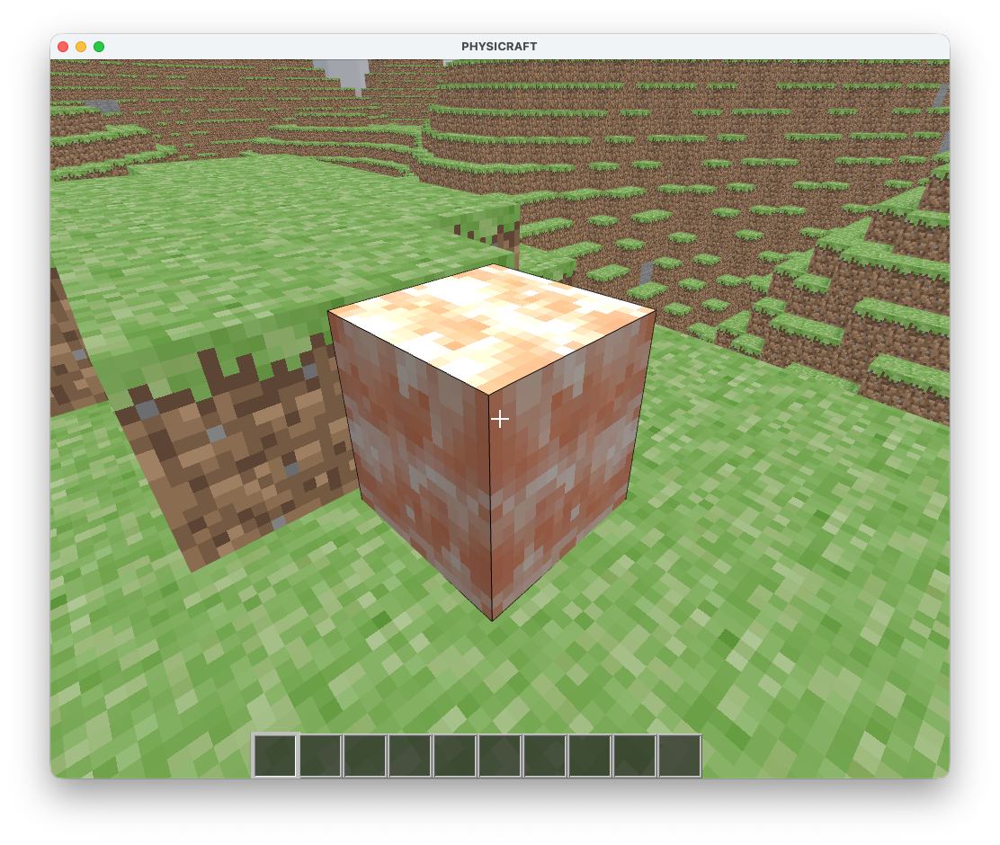</td><td>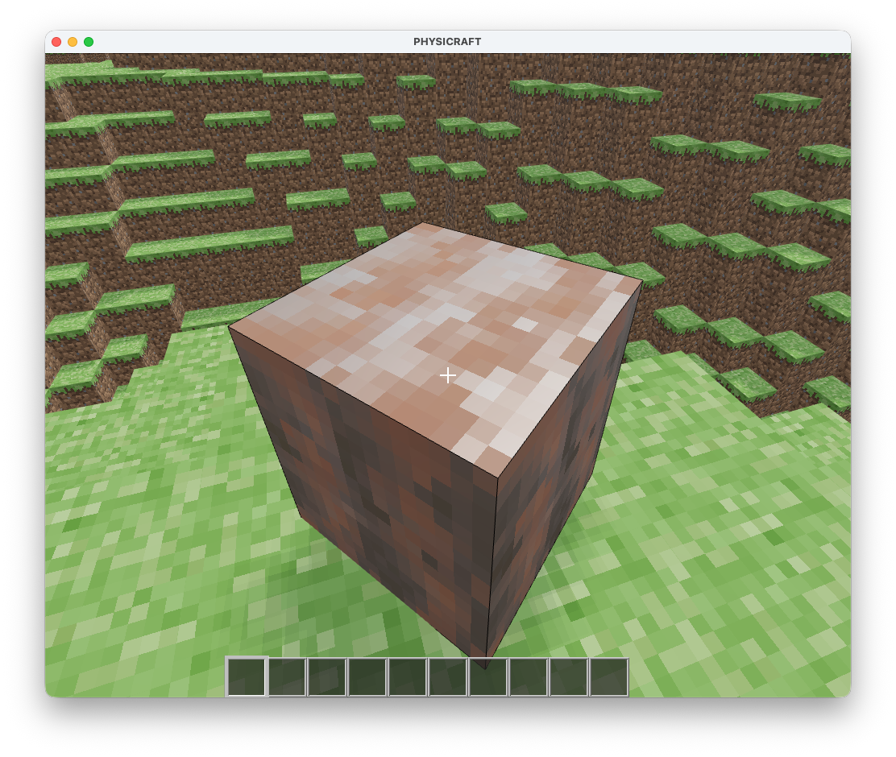</td></tr>
  <tr><td>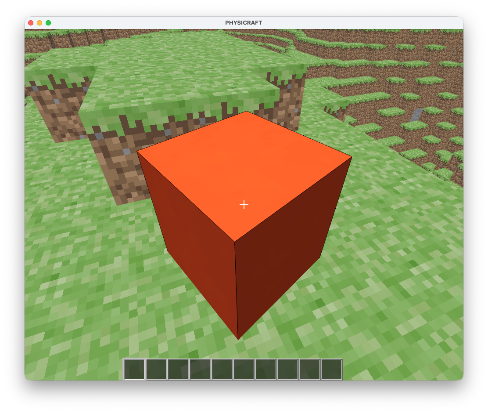</td><td>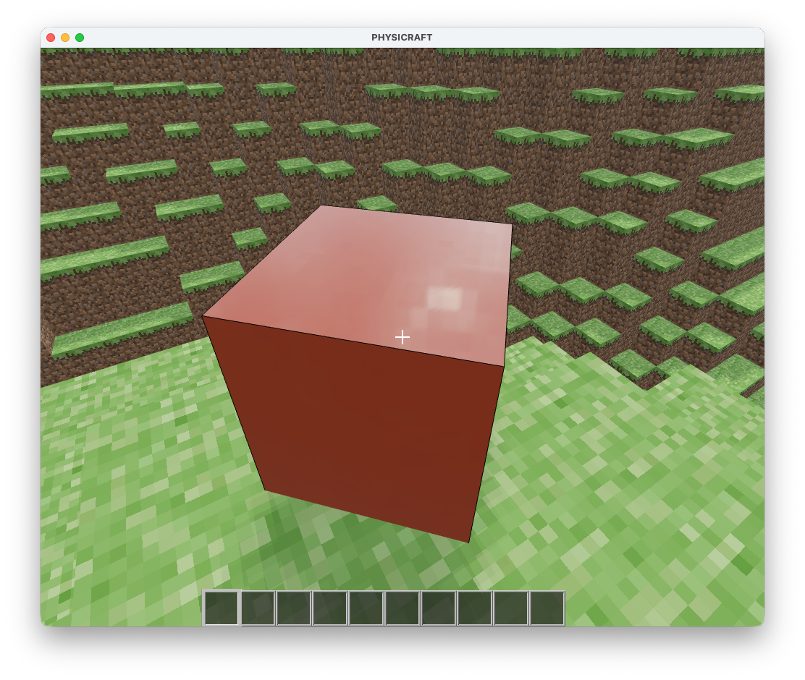</td></tr>
</table>

### Image-Based Lighting and Skybox

I added an image-based lighting preprocessing pipeline based on an HDR equirectangular environment. The engine converts the HDR image into a cubemap and precomputes the resources required by the PBR shader:

1. an irradiance cubemap for diffuse ambient lighting;
2. a prefiltered environment cubemap with mip levels for roughness-dependent reflections;
3. a BRDF lookup texture for the split-sum specular approximation.

These resources are generated once when the environment is initialized and are reused during rendering. I also implemented the skybox pass. The resulting environment lighting is particularly visible on metallic materials, which reflect the colors and brightness of the surrounding sky.

<table><tr>
<td align="center">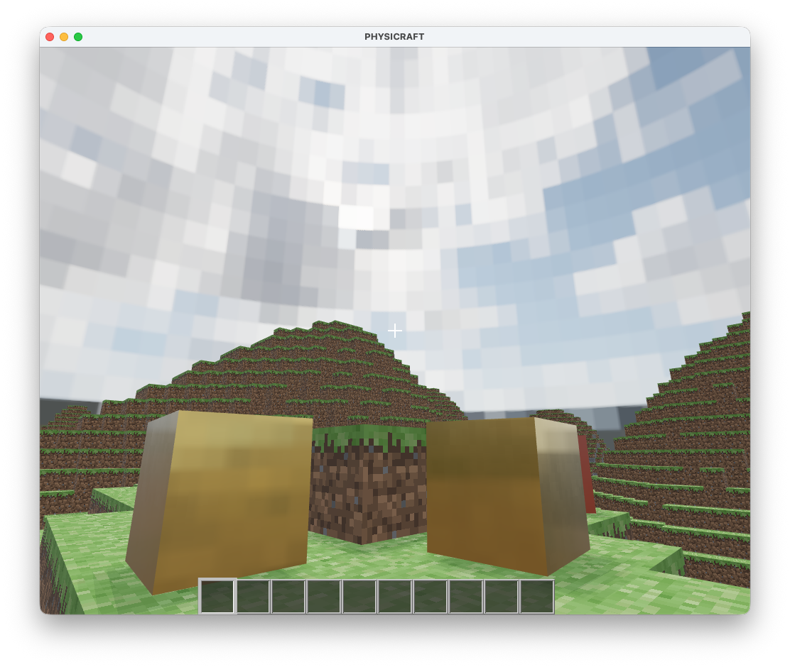<br><sub>Skybox environment</sub></td>
<td align="center">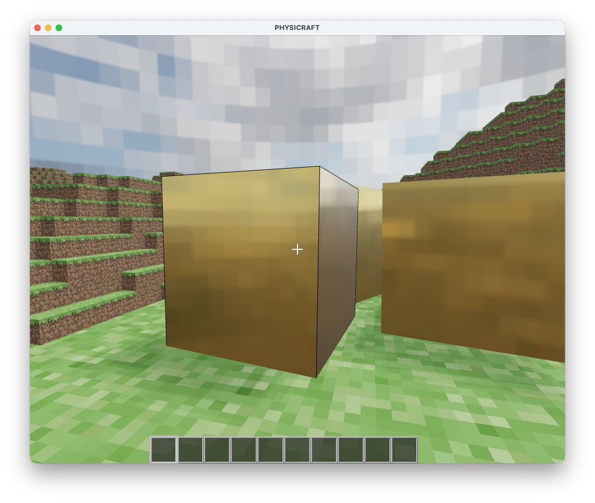<br><sub>IBL reflections on a metallic material</sub></td>
</tr></table>

### Lighting and Shadow Mapping

I connected scene lights to the material shaders and added directional lighting to the final voxel scene. For shadows, I implemented a separate depth pass that renders the scene from the directional light's point of view into a shadow map. The resulting light-space depth texture is sampled during the color pass to determine whether a fragment is shadowed.

The implementation also configures the light projection volume and uses polygon offset during the depth pass to reduce common shadow-mapping artifacts. This makes the position of cubes and voxel structures easier to read by grounding them visually on the terrain.

<p align="center">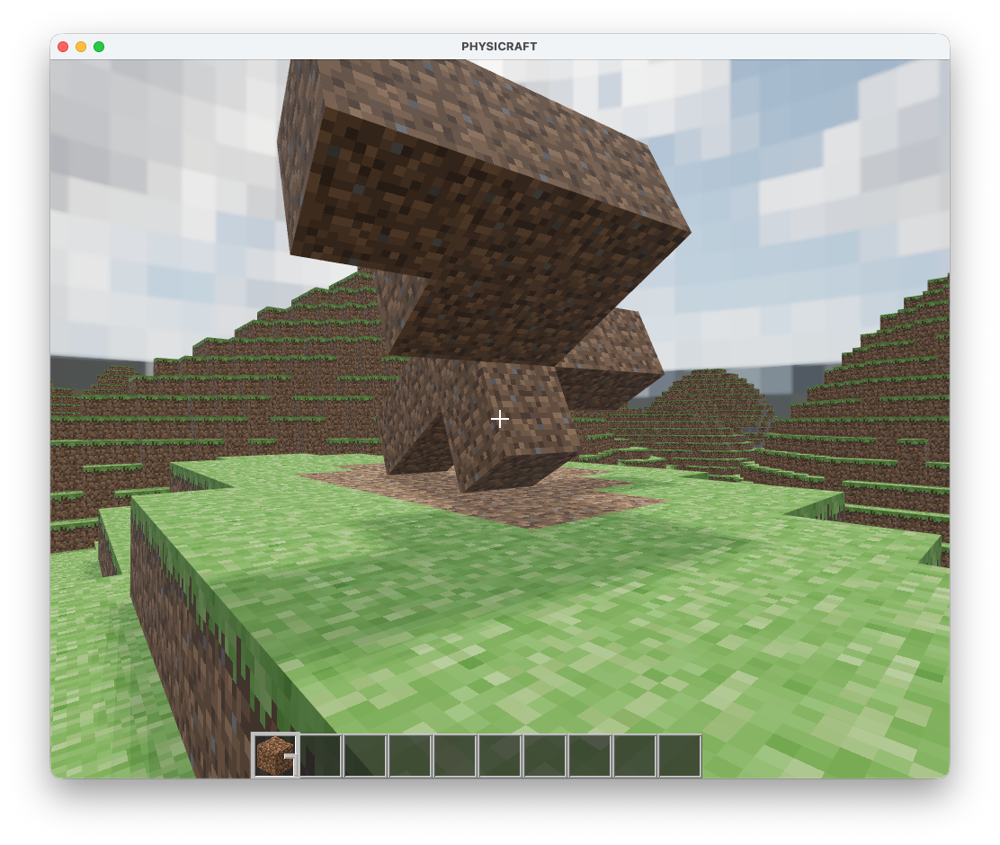</p>

### Physics Architecture and Rigid Bodies

I redesigned the physics code into separate modules for the physics world, rigid bodies, colliders, collision shapes, broad phase, narrow phase, contact cache, and contact solver. The simulation runs at a fixed time step independently of the rendering frame rate.

Each `RigidBody3D` stores physical properties such as mass, inverse inertia, linear velocity, angular velocity, gravity, friction, and restitution. The integration step updates both position and rotation. Forces and collision impulses can therefore produce translation as well as torque and angular motion.

I implemented collision shapes for cubes, spheres, capsules, triangle meshes, voxel structures, and voxel terrain. A `Collider3D` connects one of these geometric shapes to a scene object or rigid body and provides the world-space information needed by collision detection.

### Collision Detection

The collision pipeline is split into two stages:

1. The broad phase uses **Sweep and Prune** on world-space axis-aligned bounding boxes to discard pairs that cannot collide.
2. The narrow phase dispatches the remaining pairs to shape-specific tests and generates precise contact points, normals, and penetration depths.

For contacts that cover a surface rather than a single point, the narrow phase constructs a reduced contact manifold. It keeps a small set of spatially distributed contact points, which gives stacked cubes and large voxel objects more stable support than a single contact would provide.

Voxel collisions required additional handling because a voxel object is composed of many cells. The implementation restricts tests to the relevant cell range and avoids generating terrain contacts against internal, non-visible voxel faces. This supports cube-terrain, cube-voxel, voxel-terrain, and voxel-voxel interactions without testing every cell in the world.

<table><tr>
<td align="center">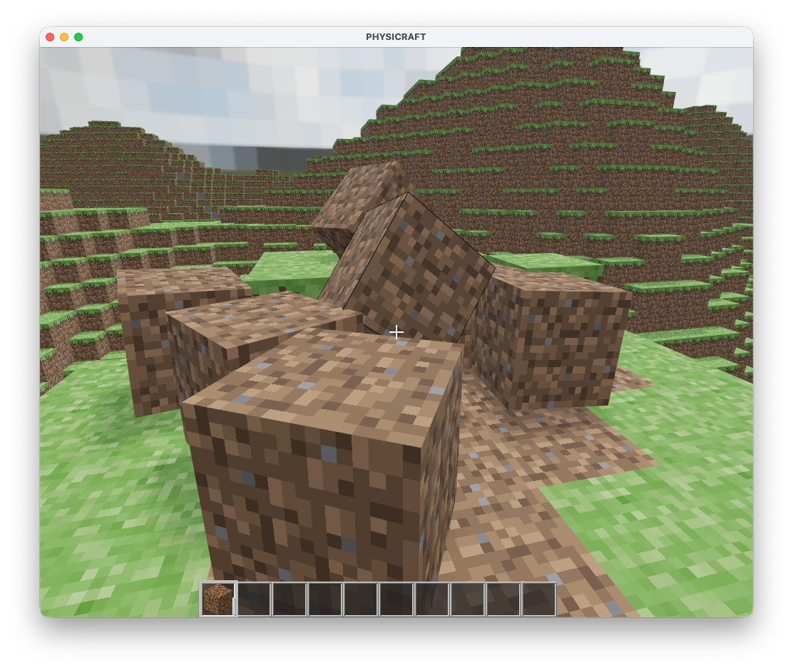<br><sub>Cube-cube and cube-terrain contacts</sub></td>
<td align="center">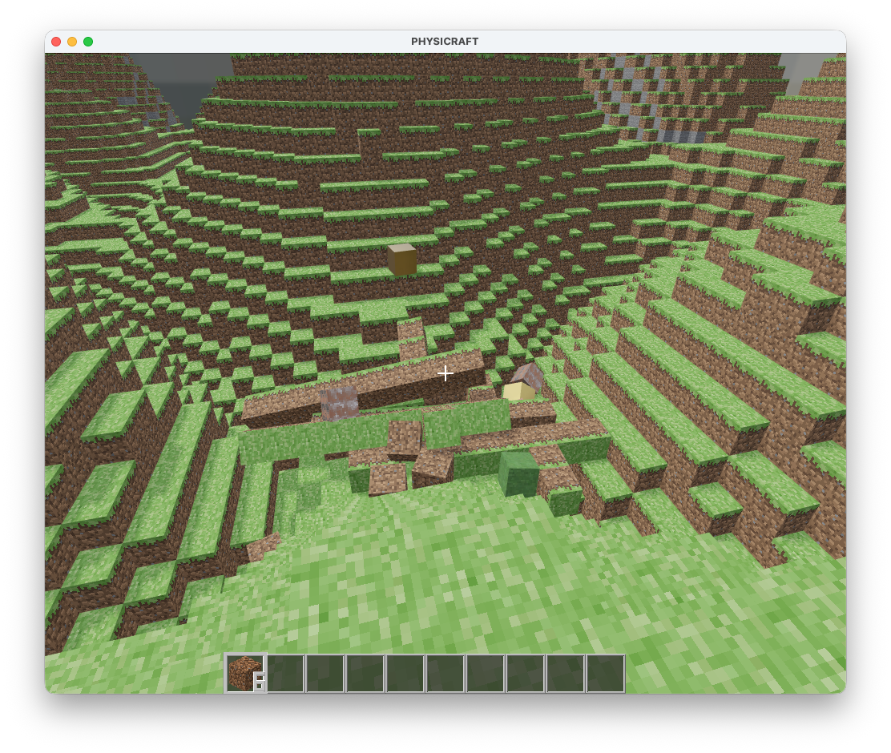<br><sub>Cube-voxel collision</sub></td>
<td align="center">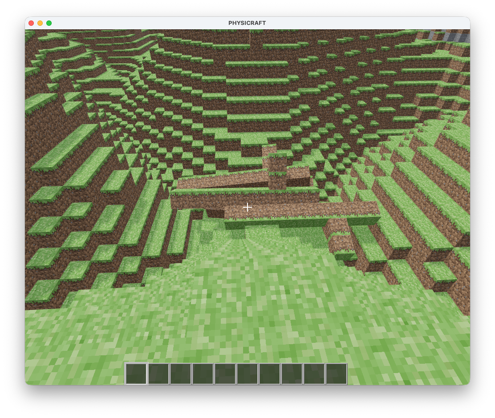<br><sub>Voxel-voxel collision</sub></td>
</tr></table>

### Contact Resolution and Stability

I implemented an impulse-based contact solver. It first applies positional correction to separate penetrating objects, then resolves their relative velocity at each contact. The effective mass includes both linear and angular components, so an off-center impact can rotate an object.

Normal impulses handle non-penetration and restitution, while tangent impulses implement Coulomb-style friction. Cached impulses are reused between physics steps to improve the stability of persistent contacts. I also added contact grouping, micro-bounce damping, per-body sleeping settings, and wake-up conditions to reduce jitter while preserving reactions to significant impacts.

These systems were tested with falling and stacked cubes, collisions between dynamic voxel structures, and contacts against the generated terrain. Much of the physics work consisted of diagnosing unstable configurations and refining position correction, contact manifolds, friction, sleeping, and collision-specific edge cases.

### Dynamic Voxel Mass Properties

I implemented the physics update required when blocks are added to or removed from a dynamic voxel structure. The engine recalculates the object's mass, center of mass, inertia, collider data, and generated mesh from the current voxel occupancy.

Moving the center of mass changes how gravity and contacts act on the structure. An asymmetric voxel construction can therefore become unbalanced, rotate under the resulting torque, and fall naturally. The update preserves the voxel structure's world-space placement while its internal physical reference frame is adjusted.

<table><tr>
<td align="center">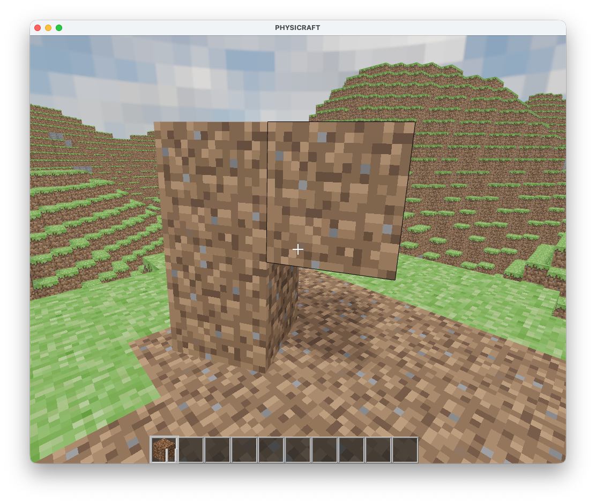<br><sub>Structure before losing balance</sub></td>
<td align="center">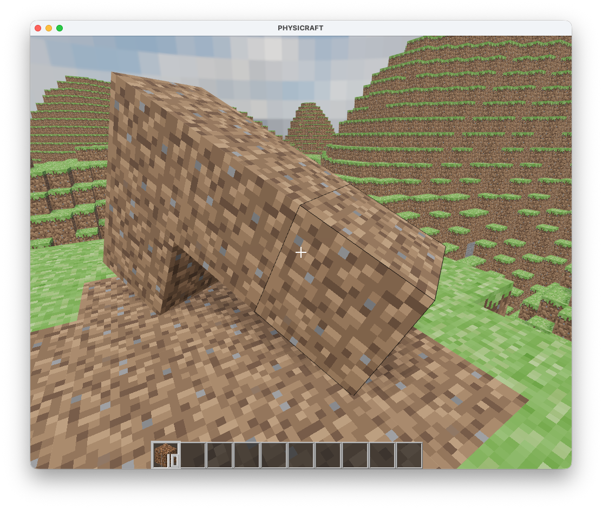<br><sub>Rotation and fall after the center of mass shifts</sub></td>
</tr></table>

## Build and Run

### Requirements

- CMake 3.0 or newer.
- A C++17-compatible compiler.
- OpenGL 3.3 or newer.
- Embree 4.
- OpenGL and X11 development packages on Linux.

GLFW, GLEW, GLM, and stb_image are included in the repository. Embree must be installed separately and discoverable by CMake.

On Ubuntu or Debian-based Linux distributions, the required packages can typically be installed with:

```bash
sudo apt update
sudo apt install build-essential cmake libembree-dev libgl1-mesa-dev libglu1-mesa-dev freeglut3-dev libx11-dev libxrandr-dev libxinerama-dev libxcursor-dev libxi-dev
```

On macOS with Homebrew:

```bash
brew install cmake embree freeglut
```

### Configure

An optimized `Release` build is recommended for the procedural terrain and physics simulation:

```bash
cmake -S . -B build -DCMAKE_BUILD_TYPE=Release
```

### Compile

```bash
cmake --build build --parallel
```

### Run

Run the executable from the build directory so that the relative resource paths resolve correctly:

```bash
cd build
./Main
```

For a debug build:

```bash
cmake -S . -B build-debug -DCMAKE_BUILD_TYPE=Debug
cmake --build build-debug --parallel
cd build-debug
./Main
```

## Repository Structure

```text
common/             Core engine code
  3dEntities/       Nodes, meshes, lights, terrain, and voxel objects
  Controls/         Camera and character controllers
  GUI/              Inventory, crosshair, and pause menu
  Materials/        Classic and PBR material systems
  Physics/          Rigid bodies, colliders, shapes, and collision solving
  Render/           Forward renderer, shaders, shadows, and IBL integration
  Utilities/        Input, geometry, ray-intersection, and Perlin-noise helpers
Scenes/             Demonstration scene construction
Shaders/            OpenGL vertex and fragment shaders
Resources/          Models, textures, HDR environments, and GUI assets
external/           Bundled third-party dependencies
rapport/            Course report and figures
```

## Current Limitations

- No visual editor for inspecting or modifying the scene graph.
- Disconnected parts of a voxel structure are not automatically separated into independent rigid bodies.
- Distant terrain generation is not multithreaded and can cause short frame-time spikes.
- Level of detail support exists in the engine but is not used by the voxel terrain prototype.

## Team

This project was developed as a two-person group project by:

- Titouan Guibert-Lodé
- Yaqi Zhang

Course: HAI819I Game Engine, University of Montpellier, 2025-2026.
